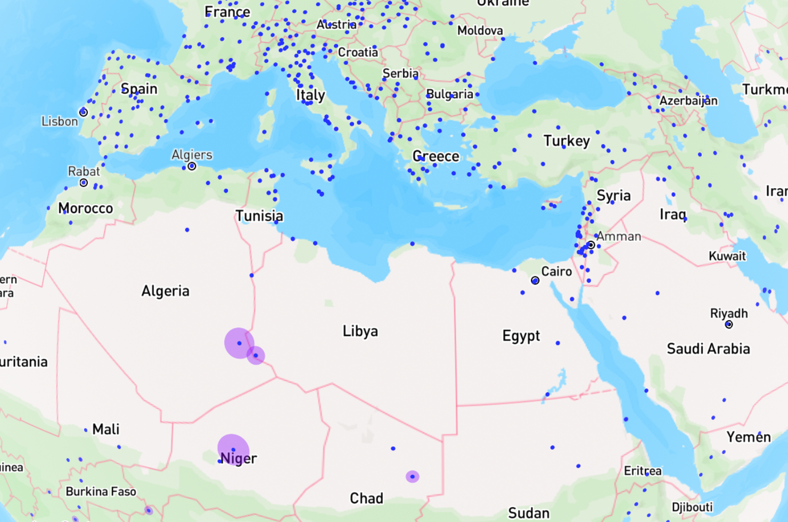

# enriching-unesco-world-heritage-list-with-wikidata
## PFCH 2024 Final Project: Enriching UNESCO's World Heritage Dataset with Wikidata

### What you will need to download:
- Jupyter Notebook [ec_unesco_enriched.ipynb](https://github.com/emilyalcu/enriching-unesco-world-heritage-list-with-wikidata/blob/d226e03cd5d8e671b96bbaf21c429feb202f3ce4/ec_unesco_enriched.ipynb)
- UNESCO's dataset
  - Either from this repository - [whc_en.xml](https://github.com/emilyalcu/enriching-unesco-world-heritage-list-with-wikidata/blob/d226e03cd5d8e671b96bbaf21c429feb202f3ce4/whc_en.xml) 
  - or from [UNESCO](https://whc.unesco.org/en/syndication)
- Three of my CVS files exported from OpenRefine
  1. [unesco_enriched_cleaned_all.csv](https://github.com/emilyalcu/enriching-unesco-world-heritage-list-with-wikidata/blob/d226e03cd5d8e671b96bbaf21c429feb202f3ce4/unesco_enriched_cleaned_all.csv)
  2. [unesco_enriched_cleaned_coordinates.csv](https://github.com/emilyalcu/enriching-unesco-world-heritage-list-with-wikidata/blob/d226e03cd5d8e671b96bbaf21c429feb202f3ce4/unesco_enriched_cleaned_coordinates.csv)
  3. [unesco_enriched_cleaned_area.csv](https://github.com/emilyalcu/enriching-unesco-world-heritage-list-with-wikidata/blob/d226e03cd5d8e671b96bbaf21c429feb202f3ce4/unesco_enriched_cleaned_area.csv)

### Project Overview
These steps can also be found as comments in the Python script
1. Convert UNESCO's dataset from XML to JSON
2. Query Wikidata and store the responses in a JSON file
     - the SPARQL query will be nested in the python script
     - query for item URI, item label, instance of URIs, instance of labels, culture URI, culture lables, and area in square meters
3. Merge the UNESCO JSON file with the Wikidata JSON file on the id_number
4. Clean up the merged JSON file in OpenRefine and export as CSVs
    - First version will contain all records: unesco_enriched_cleaned_all.csv
    - Second version will contain all records with latitude and longitude values: unesco_enriched_cleaned_coordinates.csv
    - Third version will contain all records will area values: unesco_enriched_cleaned_area.csv
5. Convert the three CSV files into JSON
6. Convert the coordinates and area JSON files into GEOJSON to use for visualizations

### Create Visualizations with the Enriched Dataset!
You can use the GEOJSON file to create interactive visualizations like [this](https://studio.mapbox.com/styles/emilyalcu/clvy7ogyq0a2t01pkeap98fpx/edit/#2.64/32.31/21.8) using mapbox and other visualization tools. 

In this visualization all World Heritage Sites (except for one) are marked with blue dots. Transparent purple dots represent the area of the site. The size of the dots shows the area of each site relative to the other sites. It is not perfectly matched to the correct sq meter area, but it is fairly close. 

### Final Reflections
If I had more time I would have liked to perfect my map visualization! I used mapbox's studio to save time, but I would have liked to use their API to get more particular about the design. I was really inspired by Calista and Natalie's work and I would have loved to be able to replicate the feature on their map where the textbox with metadata popped up when hovering over points. Beyond the visualization side of things, I was very pleased with my enriched dataset and I was really excited to learn more about SPARQL queries and OpenRefine. 
